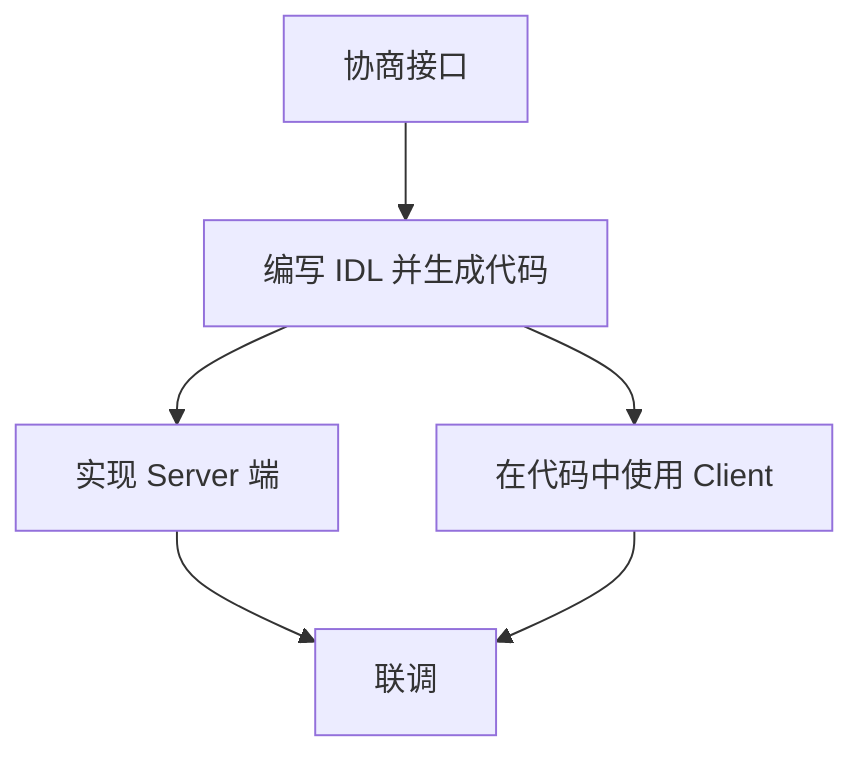

# 从 HTTP 到 gRPC

即刻后端 gRPC 落地实践

2021-11-21

---

## 快速预览

- 历史与现状
- gRPC 的使用
  - ProtoBuf 介绍
- gRPC 带来的好处
- 如果过渡
- 服务治理

---

## 背景

手写 HTTP Client 实现:

- 类型不可靠，无法保证 Client 端和 Server 端使用一致的数据类型
- 类型不安全
  - 可能错误地返回额外的字段
  - 无法保证字段不为空
- 无法兼顾多语言

---

## 引入 Protobuf IDL

```protobuf
service UserService {
  rpc GetUser(GetUserRequest) returns (GetUserResponse) {
    option(google.api.http) = {
      path: "/internals/getUser",
      body: "*"
    }
  };
}

message GetUserRequest {
  string username = 1;
}

message GetUserResponse {
  string id = 1;
  string username = 2;
  string screenName = 3;
}
```

带来的好处:

- 省去编写
- 为各种技术栈生成 client 和 server stub

---

## Protobuf IDL

---

### 强大的基础数据类型

| **Protobuf**                  | JSON            | TypeScript    | Go         |
| ----------------------------- | --------------- | ------------- | ---------- |
| **int32**                     | number          | number        | int32      |
| **int64**                     | string          | string        | int64      |
| **google.protobuf.Timestamp** | string(RFC3999) | Date          | time       |
| **google.protobuf.Value**     | any             | any           | any        |
| **google.protobuf.BoolValue** | boolean         | boolean?      | *bool      |
| **map\<K,V\>**                | object          | Record\<K,V\> | map\<K,V\> |
| **repeat V**                  | array           | Array\<V\>    | []V        |

参考: <https://developers.google.com/protocol-buffers/docs/proto3#json>

<!-- 
Protobuf 提供了强大的基础数据类型，这里展示了一些比较特殊的数据类型。
-->

---

### 不支持复杂类型

---

### 可选类型

在 ProtoBuf 3.35 开始，重新引入了 optional 类型，可以替代空值安全(Wrapper)的类型。

---
layout: two-cols
---

## 当前的开发流程



::right::

## 一个基于 gRPC 的开发流程


---

## 上线 gRPC

---

## gRPC-Gateway

---
layout: two-cols
---
## 服务发现

### HTTP1.1 

::right::

<div class="h-8"></div>

### HTTP2(连接复用)

---

### envoy sidecar


```mermaid

```

<!--
业务进程直接与 通过 envoy 反向代理
-->

---

### grpc + xDS


<!--
最近 gRPC 逐步引入了在服务网格当中通行的 xDS 协议
不需要通过 sidecar 反向代理负载均衡，自身就能够获取下游服务列表实现负载均衡
相比 sidecar 方案，能够获得非常大的性能提升
-->

---

## 熔断降级

---
layout: end
---